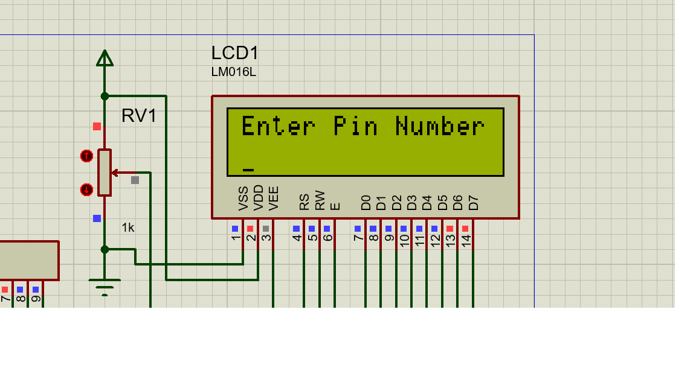
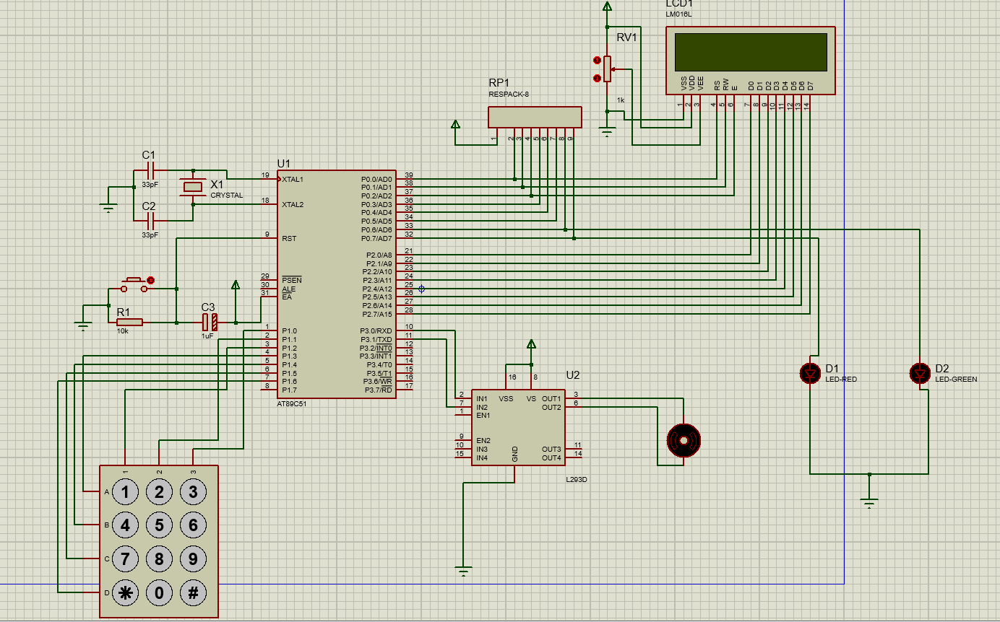

# Six-digit password-based doorlock system
## Introduction
This project was created using Proteus software for design automation and Keil as the embedded IDE. This project adds more security and user friendly features to the password based door lock systems available in the market. While also using low-cost components to reduce the overall cost of project, so that it can be accessible to everyone more easily.

## Objective
 - The objective of this project was to create a more robust, time-saving, safe and better solution to the traditional door locks(the keys and lock maneuver) that have high chances of burglary and therefore put the safety of the residents and goods at risk.
 - It reduces the headache of carrying physical keys with you all the time. Losing your keys would not be a headache anymore.
 - A smart password system accessible through a phone is better option. However, the smart password locks also come with many disadvantages of cyber attacks, wifi outages, battery problems or the worst case scenario a phone theft. Thus, this project was built on the grounds of basic password lock system with extra features.
 - These features include allowing users to change their passwords (only if the user remembers the previous one). This allows users to change their passwords frequently as using only one password for a long time will wear the surface of the buttons.
 - This also generates green and red led lights for every correct and incorrect password respectively.
 - These lights can be used as an indicator that a person is trying to access the door to the nearby people.
 - This project can ultimately be used by both residential and industrial groups.
 
 ## Steps for Construction
 **Step1: Determining the microcontroller**
 The microcontroller chosen for this project is Atmel 8051 - AT89C51. This application is fairly simple so there is no need for a 16/32 bit microcontroller. These costs low, use low power and the newer variants are more powerful. For a hardware just for checking passwords 8051 family is perfect.
 
 **Step2: Determining other components**
 This project uses 6-digits for ensuring high security of the passwords. A L293D is used since the 12V motors cannot be directly used with the microcontroller. A simple LM016L can be used as 16x2 LCD module for displaying messages. Other components like crystals, resistors and a toggle button improve the functionality of the whole system.
 
 **Step3: Working**
 - The code for this project is written in embedded C. 
 - The default password for the device is taken as "123456" which can be changed by entering a reset code "**00##" which allows users to enter a reset mode, after which they will be prompted to enter the current pin for security reasons. 
 - If the users fail to do so they will be taken out of the reset mode by default. If they succeed, the users can enter a new custom password. 
 - After changing the password the user will be prompted with the password screen again where they will have to enter their new custom password.
 - For every wrong password, a red led lights glows whereas for every correct password a green light glows.
 - Default mode password - "123456", Reset mode - "**00##".
 
 
 
 ## Components Used
  - 8051 AT89c51 x 1
  - LCD 16x2 Display Module x 1
  - 4x3 Matrix Keypad x 1
  - LED 5mm x 2
  - Resistor 10K 0603 x 1
  - Resistor 1K 0603 x 8
  - Breadboard x 1
  - L293D Motor Driver x 1
  - Crystal Oscillator x 1
  - Push buttons x 1
  - Capacitor 33pF x 2
  - Capacitor 1uF x 1
  - 1k Potentiometer x 1
  - 5v 3amp power supply x 4
  - Ground x 5
  
## Simulation Video

https://user-images.githubusercontent.com/86883449/180877693-6556a8d5-1761-4fea-9c0c-660da659253b.mp4

